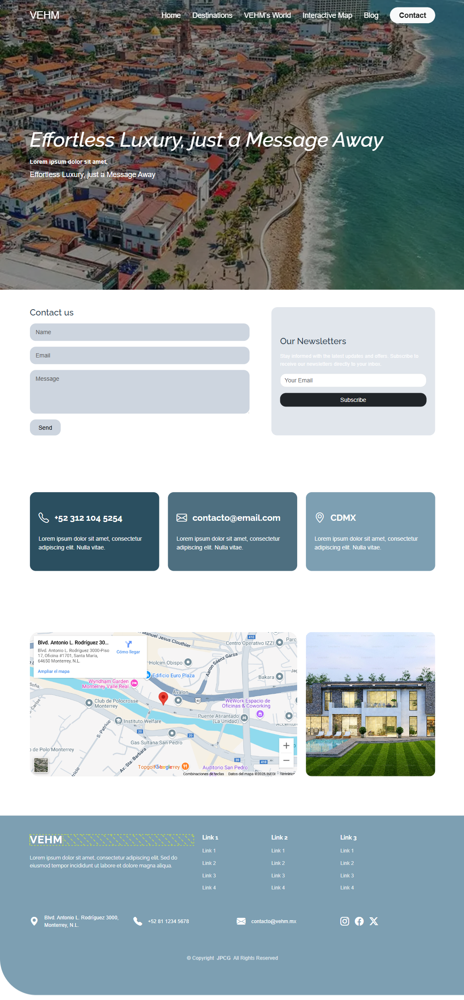

# Sitio Web de Prueba Técnica

Este es un sitio web de prueba técnica diseñado para demostrar el uso de **Bootstrap 5** junto con **CSS puro** para el estilo y diseño.

## Características

- Diseño responsivo con Bootstrap 5.
- Uso de CSS personalizado para estilos adicionales.
- Navbar con efecto de cambio de color al hacer scroll.
- Sección hero con imagen de fondo y overlay semitransparente para mejorar la visibilidad del texto.

---

## Tecnologías utilizadas

- [Bootstrap 5](https://getbootstrap.com/)
- CSS puro

---

## Cómo usar

1. Clonar o descargar el repositorio.
2. Abrir el archivo `index.html` en un navegador web moderno.
3. Visualizar el diseño y probar la navegación.

---

